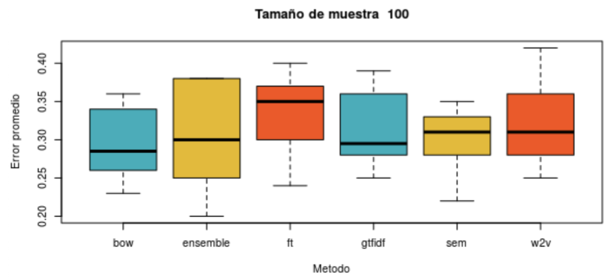

# EQuAL analysis of variance
Variance analysis of the EQuAL method for the thesis "**Desarrollo de una medida de 
similaridad para Sistemas de Recomendación en sitios de Community Question Answering. Análisis desde un enfoque 
Big Data y usando un método de ensamble de clustering**" [See thesis PDF document](https://github.com/fedetesone/tesis_latex/blob/main/tesis.pdf)".

The state-of-art algorithms and the EQuAL method (based on the ensemble of each of them), generate data sets that are used as the imput
of this analysis. Given μ<sub>0</sub> as the error expected value (mathematical expectation) of the EQuAL method, 
μ<sub>i</sub>, i = 1,2,3,4,5 are defined as the error expected value of the methods TF, TFIDF, FastText, Word2Vec y Semantic Distance
respectively. The following hypotheses are defined:
- H<sub>0</sub> = μ<sub>0</sub> - μ<sub>i</sub> = 0, i = 1,2,3,4,5.
- H<sub>1</sub> = μ<sub>0</sub> - μ<sub>i</sub> <> 0, i = 1,2,3,4,5.

This code analyses the error average values of each of the methods and compares the EQuAL's value with each 
of the state-of-art algorithms. In order to do that, the Tukey method is used to build confidence intervals for 
each average differences pair-to-pair, for each sample size.

## Output sample
```R
                 diff        lwr       upr     p adj
ensemble-bow     0.008 -0.0589175 0.0749175 0.9992360
ft-ensemble      0.030 -0.0369175 0.0969175 0.7702455
gtfidf-ensemble  0.007 -0.0599175 0.0739175 0.9996012
sem-ensemble    -0.003 -0.0699175 0.0639175 0.9999940
w2v-ensemble     0.013 -0.0539175 0.0799175 0.9923331
```

